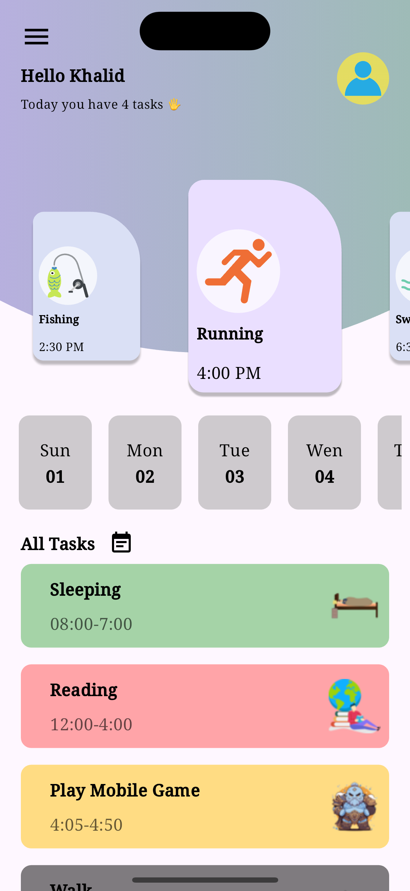
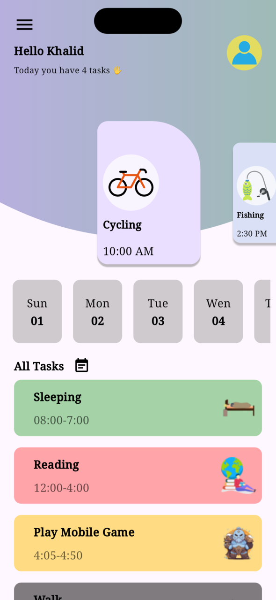
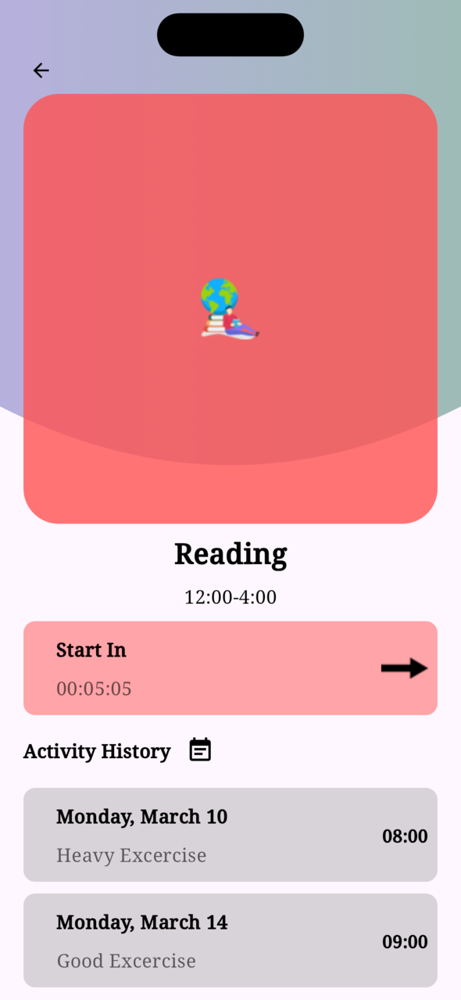
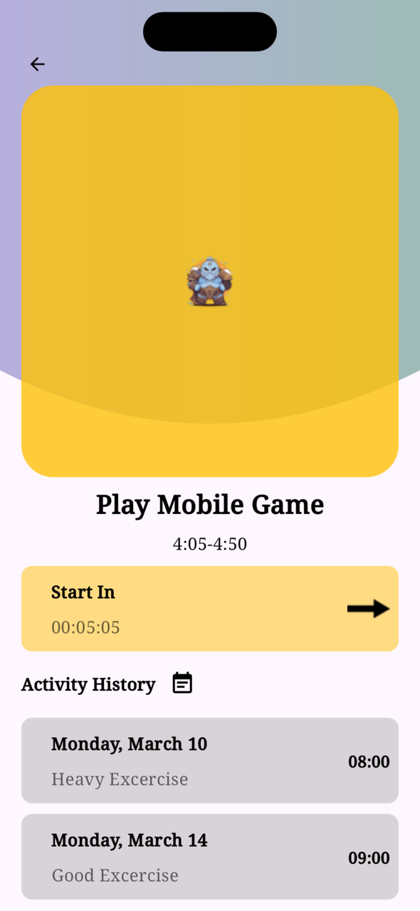

# Flutter Task List UI

I have got motivation to build the task list ui is my inspiration from dribble https://dribbble.com/shots/24208668-To-Do-List-App
## Features
1. Listview animation
2. Custom drawings
3. SnapView
4. Params usage and Fill list

